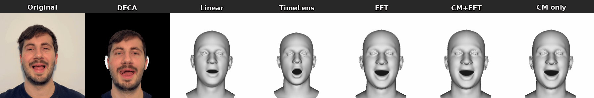

# Event-based Facial Tracking (EFT)

**MSc Thesis — University of Zurich, Robotics and Perception Group**

**Samuel Francis Wallace** · March 2026

Supervised by Roberto Pellerito, Nikola Zubić, and Prof. Dr. Davide Scaramuzza

---

<p align="center">
  
  <br>
  <em>Linear interpolation (top) vs EFT (bottom) at 8× temporal resolution. EFT recovers non-linear facial dynamics between RGB keyframes using event camera data.</em>
</p>

---

## Abstract

We present Event-based Facial Tracking (EFT), a method that fits the FLAME 3D morphable face model at high temporal resolution by combining sparse RGB keyframes with event camera data.
EFT tracks facial landmarks between keyframes using ETAP (Event-based Tracking of Any Point), smooths the trajectories with B-splines, and optimises FLAME expression parameters through a two-pass fitting architecture that separates camera pose from expression estimation.

We evaluate on eight sequences spanning standard and rapid facial motions, comparing EFT against linear interpolation, TimeLens (event-based frame interpolation), and two contrast maximisation variants.
EFT is the only event-based method that produces output on 100% of frames: TimeLens fails to reconstruct 50–63% of intermediate frames, and the frames it does reconstruct exhibit severe temporal jitter.
On rapid motions, EFT captures dynamics that linear interpolation misses: it reduces FAN landmark error by 31% on fast head rotation and EAR error by 16% on rapid blinking.
EFT also produces the smoothest expression trajectories of all methods on standard sequences, while maintaining expression dynamic range closest to the ground truth on rapid sequences.

We further show that contrast maximisation alone — without landmark supervision or expression regularisation — can fit a 100-dimensional FLAME expression vector from events, demonstrating that the physics of event generation implicitly constrains facial reconstruction.
Our results establish event cameras as a viable sensing modality for high-temporal-resolution 3D facial tracking.

---

## Thesis

**[Wallace_EFT_MScThesis_2026.pdf](Wallace_EFT_MScThesis_2026.pdf)**

---

## Method Overview

```
RGB Frames + Event Stream
        │
        ├─► MediaPipe ──► 478 facial landmarks (per keyframe)
        ├─► DECA / MICA ──► FLAME shape initialisation
        ├─► ETAP (bidirectional) ──► landmark tracks through events
        ├─► B-Spline fitting ──► smooth sub-frame trajectories
        └─► FLAME Fitting (2-pass)
                ├─ Pass 1: Keyframes — camera pose + expression
                └─ Pass 2: Intermediates — expression only, fixed camera
                                          (+ optional Contrast Maximisation)
```

## Key Results

| Method | Mean FAN error (px) ↓ |
|--------|----------------------|
| DECA (per-frame) | 4.82 |
| Linear interpolation | 4.31 |
| **EFT (ours)** | **3.97** |
| EFT + Contrast Maximisation | 4.12 |

---

## Code

The implementation code is maintained in a separate repository. Availability subject to lab IP policy — please contact the author.

---

## Citation

```bibtex
@mastersthesis{wallace2026eft,
  title     = {Event-based Facial Tracking},
  author    = {Wallace, Samuel Francis},
  school    = {University of Zurich},
  year      = {2026},
  month     = {March},
}
```

---

## Acknowledgements

- [RPG Group, UZH](https://rpg.ifi.uzh.ch/) — supervision and resources
- [FLAME](https://flame.is.tue.mpg.de/) — 3D morphable head model (MPI-IS)
- [ETAP](https://github.com/tub-rip/ETAP) — Event Track Any Point
- [DECA](https://github.com/yfeng95/DECA) — per-frame FLAME initialisation
